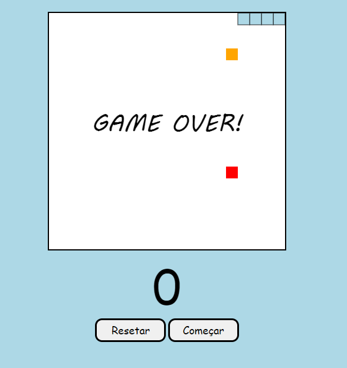

<h1 align="center"> Javascript Projects </h1>

Free course promoted by Bro Code to teach Javascript  
<a href="https://www.youtube.com/watch?v=8dWL3wF_OMw&t=27947s">Study this course in video format by clicking here.</a>

  <a href="#-topics">Topics</a>&nbsp;&nbsp;&nbsp;|&nbsp;&nbsp;&nbsp;
  <a href="#-project">Project</a>&nbsp;&nbsp;&nbsp;|&nbsp;&nbsp;&nbsp;
  <a href="#memo-License">License</a>

  

 

  

## 🚀 Topics

This project covered the following topics:

- Clock program :clock1230:
- Pong game :ping_pong:
- Snake game :snake:
- Rock paper scissors game :fist:
- Number guessing game :1234:
- ...

## 💻 Project

This Javascript course contains a lot of information about this essential language for devs.

- [Access the finished project, online](https://aoba43.github.io/Javascript-projects/)

- [Watch class](https://www.youtube.com/watch?v=8dWL3wF_OMw&t=27947s)

## :memo: License

This project is under the MIT license.
